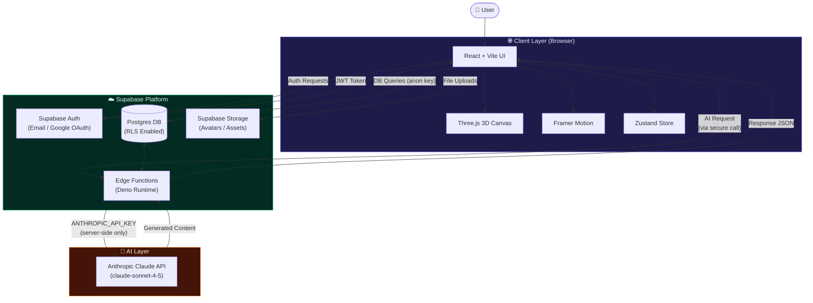
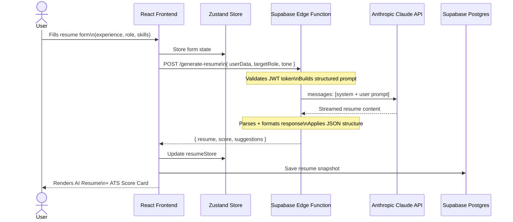
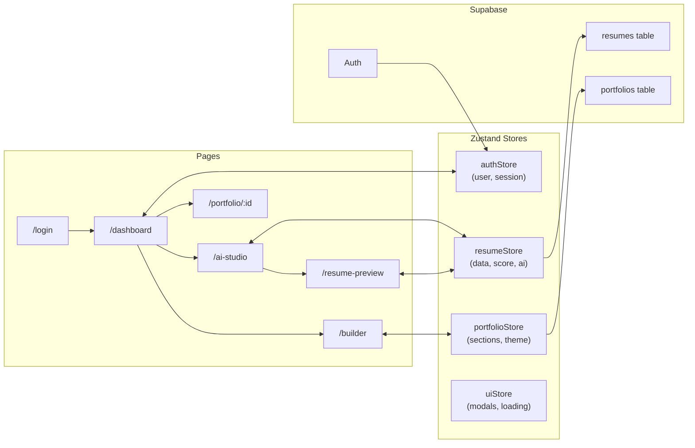

<div align="center">

# ✦ NEXFOLIO

### *Build Your Universe. Let AI Write Your Story.*

**The next-generation 3D AI-powered portfolio & resume builder — where immersive Three.js visuals meet Anthropic Claude intelligence.**

<br/>


<br/>


<br/>

[**Live Demo →**](https://nexfolio.vercel.app) &nbsp;·&nbsp; [**Report Bug**](https://github.com/yourusername/nexfolio/issues) &nbsp;·&nbsp; [**Request Feature**](https://github.com/yourusername/nexfolio/discussions)

</div>

---

<br/>

## 📸 Preview

<div align="center">

| Landing Page | Dashboard |
|:---:|:---:|
|  |  |

| AI Resume Studio | Portfolio Builder |
|:---:|:---:|
|  |  |

</div>

---

<br/>

## 🌌 Overview

**Nexfolio** is a SaaS-grade portfolio and resume builder that combines **immersive 3D experiences** with **real AI intelligence** to help professionals stand out in a competitive job market.

Unlike traditional resume builders, Nexfolio is powered by **Anthropic Claude** — giving users AI-generated resume content, real-time ATS scoring, intelligent skill gap analysis, and a living 3D portfolio that makes first impressions unforgettable.

> 💡 **The vision:** Your career story deserves more than a PDF. Nexfolio turns your professional journey into a dynamic, AI-enhanced experience that recruiters and hiring managers won't forget.

### What makes Nexfolio different?

| Traditional Builders | ✦ Nexfolio |
|---|---|
| Static templates | Immersive 3D animated portfolios |
| Manual resume writing | AI-generated content via Claude |
| No feedback | Real-time ATS score + suggestions |
| Generic skill lists | AI-powered skill gap analysis |
| Basic auth | Supabase Auth + Google OAuth |
| Client-side only | Edge Functions for secure AI calls |

---

<br/>

## ✨ Features

### 🎮 3D Animated Portfolio UI
> Built with `@react-three/fiber` and `@react-three/drei`, your portfolio becomes an interactive 3D experience — custom scenes, animated particles, camera controls, and smooth transitions powered by Framer Motion.

### 🤖 AI Resume Generator
> Describe your experience in plain English. Claude transforms it into polished, professional resume content tailored to your target role — in seconds.

### 📊 ATS Resume Scoring
> Paste a job description and your resume. Claude analyzes keyword alignment, formatting quality, and ATS compatibility — giving you a score and actionable fixes.

### 💡 AI Skill Suggestions
> Based on your current stack and target role, Claude recommends high-value skills to learn, certifications to pursue, and gaps to close.

### 🏗️ Portfolio Builder
> Drag-and-drop sections: projects, skills, testimonials, timeline — all rendered in a beautiful 3D canvas. Share via a public link.

### 🔐 Authentication System
> Email/password and Google OAuth via Supabase Auth. Protected routes, session persistence, and secure user profiles.

### ☁️ Supabase Backend
> Postgres database with Row Level Security (RLS). Real-time data sync, file storage for avatars/assets, and Edge Functions for server-side AI calls.

---

<br/>

## 🛠️ Tech Stack

| Layer | Technology | Purpose |
|---|---|---|
| **Frontend Framework** | React 18 + Vite 5 | Component architecture & blazing-fast HMR |
| **Styling** | Tailwind CSS 3 | Utility-first responsive design system |
| **3D Engine** | Three.js + React Three Fiber + Drei | 3D scenes, meshes, shaders, and controls |
| **Animations** | Framer Motion 11 | Page transitions, micro-interactions, gestures |
| **State Management** | Zustand 4 | Lightweight global store — auth, resume, UI state |
| **Backend / Auth** | Supabase | Postgres DB, Auth, Edge Functions, Storage |
| **AI Engine** | Anthropic Claude API | Resume generation, ATS scoring, skill analysis |
| **Deployment** | Vercel + Supabase Cloud | CI/CD, CDN, serverless edge compute |

---

<br/>

## 🏛️ Architecture

### System Architecture Diagram



---

### AI Resume Generation Flow



---

### Application State Flow



---

<br/>

## 🚀 Getting Started

### Prerequisites

Make sure you have the following installed:

```bash
node >= 18.0.0
npm  >= 9.0.0
```

---

### 1. Clone the Repository

```bash
git clone https://github.com/yourusername/nexfolio.git
cd nexfolio
```

---

### 2. Install Dependencies

```bash
npm install
```

---

### 3. Configure Environment Variables

Create a `.env` file in the project root:

```bash
cp .env.example .env
```

Then fill in your values:

```env
# ─── Supabase ─────────────────────────────────────────────
VITE_SUPABASE_URL=https://your-project-id.supabase.co
VITE_SUPABASE_ANON_KEY=your-anon-key-here

# ─── App Config ───────────────────────────────────────────
VITE_APP_URL=http://localhost:5173
VITE_APP_NAME=Nexfolio

# ─── DO NOT ADD ANTHROPIC KEY HERE ────────────────────────
# The Anthropic API key lives ONLY in Supabase Edge Function secrets.
# Never expose it in frontend environment variables.
```

> ⚠️ **Important:** The `ANTHROPIC_API_KEY` is **never** stored in your `.env` file. It is configured exclusively as a Supabase Edge Function secret. See [Security Notes](#-security-notes).

---

### 4. Start the Development Server

```bash
npm run dev
```

The app will be available at `http://localhost:5173`

---

### 5. Build for Production

```bash
npm run build
npm run preview
```

---

<br/>

## 🔑 Environment Variables

A full breakdown of every environment variable used in this project:

| Variable | Location | Exposed to Client | Description |
|---|---|:---:|---|
| `VITE_SUPABASE_URL` | `.env` | ✅ Safe | Your Supabase project URL |
| `VITE_SUPABASE_ANON_KEY` | `.env` | ✅ Safe | Public anon key (RLS-protected) |
| `VITE_APP_URL` | `.env` | ✅ Safe | App's base URL for OAuth redirects |
| `SUPABASE_SERVICE_ROLE_KEY` | Supabase Secrets only | ❌ Secret | Admin DB access — **never expose** |
| `ANTHROPIC_API_KEY` | Supabase Edge Secrets | ❌ Secret | Claude API key — **server-side only** |

### Setting Edge Function Secrets

```bash
# Install Supabase CLI
npm install -g supabase

# Login and link project
supabase login
supabase link --project-ref your-project-id

# Set the Anthropic API key as a secret
supabase secrets set ANTHROPIC_API_KEY=sk-ant-your-key-here

# Verify secrets are set
supabase secrets list
```

---

<br/>

## 🗄️ Supabase Setup

### 1. Create a Supabase Project

1. Go to [supabase.com](https://supabase.com) and create a new project
2. Copy your **Project URL** and **Anon Key** from `Settings → API`
3. Paste them into your `.env` file

---

### 2. Run Database Migrations

```bash
# Apply all migrations to your Supabase project
supabase db push
```

Or manually run the SQL files in `/supabase/migrations/` via the Supabase SQL Editor.

**Core Tables:**

```sql
-- Users extended profile
create table profiles (
  id uuid references auth.users primary key,
  full_name text,
  avatar_url text,
  headline text,
  created_at timestamptz default now()
);

-- Resumes table
create table resumes (
  id uuid default gen_random_uuid() primary key,
  user_id uuid references auth.users not null,
  title text,
  content jsonb,
  ats_score integer,
  created_at timestamptz default now()
);

-- Portfolios table
create table portfolios (
  id uuid default gen_random_uuid() primary key,
  user_id uuid references auth.users not null,
  slug text unique,
  sections jsonb,
  theme text default 'cosmic',
  is_public boolean default false,
  created_at timestamptz default now()
);
```

---

### 3. Enable Row Level Security (RLS)

```sql
-- Enable RLS on all tables
alter table profiles enable row level security;
alter table resumes enable row level security;
alter table portfolios enable row level security;

-- Example policy: users can only access their own data
create policy "Users can view own profile"
  on profiles for select using (auth.uid() = id);

create policy "Users can manage own resumes"
  on resumes for all using (auth.uid() = user_id);
```

---

### 4. Configure Authentication

In your Supabase dashboard → **Authentication → Settings**:

- **Site URL:** `https://your-app.vercel.app`
- **Redirect URLs:** Add `https://your-app.vercel.app/auth/callback`

**Enable Google OAuth (Optional):**

1. Go to [Google Cloud Console](https://console.cloud.google.com)
2. Create OAuth 2.0 credentials
3. Add your Supabase callback URL: `https://your-project.supabase.co/auth/v1/callback`
4. In Supabase → Authentication → Providers → Enable Google → paste Client ID + Secret

---

### 5. Deploy Edge Functions

```bash
# Deploy all edge functions
supabase functions deploy generate-resume
supabase functions deploy ats-score
supabase functions deploy skill-suggestions

# Or deploy all at once
supabase functions deploy
```

**Edge Function Structure:**

```
supabase/
└── functions/
    ├── generate-resume/
    │   └── index.ts       ← AI resume generation
    ├── ats-score/
    │   └── index.ts       ← ATS analysis + scoring
    └── skill-suggestions/
        └── index.ts       ← Skill gap analysis
```

---

<br/>

## 🤖 AI / Edge Function Deep Dive

### Why Are AI Calls Server-Side?

Anthropic API keys **must never be exposed to the browser**. If a key is embedded in frontend code or environment variables prefixed with `VITE_`, it becomes readable by anyone who inspects your app's network traffic or source code.

Nexfolio solves this by routing all AI requests through **Supabase Edge Functions** — serverless Deno functions that run in Supabase's secure cloud environment.

```
Browser → Supabase Edge Function → Anthropic Claude
           (JWT validated here)    (key stays server-side)
```

---

### Example: `generate-resume` Edge Function

```typescript
// supabase/functions/generate-resume/index.ts
import Anthropic from "npm:@anthropic-ai/sdk";

const anthropic = new Anthropic({
  apiKey: Deno.env.get("ANTHROPIC_API_KEY")!, // ← Secure server-side secret
});

Deno.serve(async (req) => {
  // Validate Supabase JWT
  const authHeader = req.headers.get("Authorization");
  if (!authHeader) return new Response("Unauthorized", { status: 401 });

  const { experience, targetRole, tone } = await req.json();

  const message = await anthropic.messages.create({
    model: "claude-sonnet-4-5",
    max_tokens: 2048,
    messages: [
      {
        role: "user",
        content: `You are an expert resume writer. 
        Generate a professional resume for someone with the following background:
        Experience: ${experience}
        Target Role: ${targetRole}
        Tone: ${tone}
        
        Return a structured JSON with sections: summary, experience, skills, education.`,
      },
    ],
  });

  return new Response(
    JSON.stringify({ resume: message.content[0].text }),
    { headers: { "Content-Type": "application/json" } }
  );
});
```

---

### Calling the Edge Function from React

```typescript
// src/lib/ai.ts
import { supabase } from "./supabase";

export async function generateResume(payload: ResumePayload) {
  const { data, error } = await supabase.functions.invoke("generate-resume", {
    body: payload,
  });

  if (error) throw new Error(error.message);
  return data;
}
```

> The Supabase client automatically attaches the user's JWT — no manual auth headers needed.

---

<br/>

## 🌐 Deployment

### Deploy Frontend to Vercel

```bash
# Install Vercel CLI
npm install -g vercel

# Deploy
vercel --prod
```

**Or connect via GitHub:**
1. Push your repo to GitHub
2. Go to [vercel.com](https://vercel.com) → New Project → Import repo
3. Add environment variables in **Vercel Dashboard → Settings → Environment Variables**:

| Key | Value |
|---|---|
| `VITE_SUPABASE_URL` | `https://your-project.supabase.co` |
| `VITE_SUPABASE_ANON_KEY` | `your-anon-key` |
| `VITE_APP_URL` | `https://nexfolio.vercel.app` |

---

### Deploy Edge Functions to Supabase

```bash
# Deploy all functions to production
supabase functions deploy --project-ref your-project-id

# Confirm secrets are set in production
supabase secrets list --project-ref your-project-id
```

---

### Post-Deployment Checklist

```
✅  Vercel deployment successful
✅  VITE_SUPABASE_URL set in Vercel
✅  VITE_SUPABASE_ANON_KEY set in Vercel
✅  ANTHROPIC_API_KEY set as Supabase secret
✅  Supabase Edge Functions deployed
✅  Auth redirect URLs updated to production domain
✅  RLS policies verified on all tables
✅  Google OAuth callback URL updated (if applicable)
✅  Custom domain configured (optional)
```

---

<br/>

## 🔒 Security Notes

Security is not optional — it's foundational. Here's how Nexfolio is built to be secure by default.

### Key Hierarchy

```
PUBLIC (safe to expose)
├── VITE_SUPABASE_URL          → Used in frontend code ✅
└── VITE_SUPABASE_ANON_KEY     → Used in frontend code ✅
                                  (Protected by RLS policies)

SECRET (never expose)
├── SUPABASE_SERVICE_ROLE_KEY  → Admin access, bypasses RLS ❌
│                                 Only use in trusted server code
└── ANTHROPIC_API_KEY          → Supabase Edge Function secret ❌
                                  Never in frontend, never in .env
```

### Security Rules

> **Rule 1 — Anon Key ≠ Admin Key**
> The `ANON_KEY` is safe to expose because it's protected by **Row Level Security (RLS)**. Without RLS enabled on your tables, the anon key gives open access. Always enable RLS.

> **Rule 2 — Never Commit Secrets**
> Add `.env` to your `.gitignore`. Use `.env.example` with placeholder values for documentation.

> **Rule 3 — Service Role Key = Nuclear Option**
> The `SERVICE_ROLE_KEY` bypasses all RLS policies. It should **only** be used in trusted server environments (never in Edge Functions called by users, never in frontend).

> **Rule 4 — Validate JWTs in Edge Functions**
> Every Edge Function should validate the Authorization header before processing AI requests to prevent abuse.

> **Rule 5 — Rate Limit AI Endpoints**
> Implement per-user rate limiting in Edge Functions to prevent runaway Claude API costs.

---

<br/>

## 📁 Project Structure

```
nexfolio/
├── public/                   # Static assets
├── screenshots/              # README preview images
├── src/
│   ├── components/
│   │   ├── ui/               # Reusable UI components
│   │   ├── 3d/               # Three.js / R3F scenes
│   │   ├── resume/           # Resume builder components
│   │   └── portfolio/        # Portfolio section components
│   ├── pages/
│   │   ├── Landing.tsx
│   │   ├── Dashboard.tsx
│   │   ├── AIStudio.tsx
│   │   ├── Builder.tsx
│   │   └── Portfolio.tsx
│   ├── stores/               # Zustand stores
│   │   ├── authStore.ts
│   │   ├── resumeStore.ts
│   │   └── portfolioStore.ts
│   ├── lib/
│   │   ├── supabase.ts       # Supabase client
│   │   ├── ai.ts             # Edge Function callers
│   │   └── utils.ts
│   ├── hooks/                # Custom React hooks
│   ├── types/                # TypeScript type definitions
│   └── main.tsx
├── supabase/
│   ├── functions/
│   │   ├── generate-resume/
│   │   ├── ats-score/
│   │   └── skill-suggestions/
│   └── migrations/           # SQL migration files
├── .env.example
├── tailwind.config.ts
├── vite.config.ts
└── package.json
```

---

<br/>

## 🗺️ Roadmap

### ✅ Completed
- [x] 3D portfolio canvas with React Three Fiber
- [x] Supabase Auth (email + Google OAuth)
- [x] AI resume generation via Claude
- [x] ATS scoring system
- [x] AI skill suggestions
- [x] Protected routes + session management
- [x] Postgres DB with RLS

### 🔄 In Progress
- [ ] Resume preview & live editor
- [ ] Public portfolio share links
- [ ] Custom 3D themes

### 🔮 Future Features
- [ ] **PDF Export** — One-click ATS-friendly PDF generation
- [ ] **AI Templates** — Claude-curated resume templates by industry
- [ ] **Drag & Drop Builder** — Visual section reordering
- [ ] **Premium UI Themes** — Glassmorphism, cyberpunk, minimal ink
- [ ] **Portfolio Analytics** — Visitor tracking + engagement metrics
- [ ] **LinkedIn Import** — Auto-populate resume from LinkedIn profile
- [ ] **Cover Letter AI** — Claude-generated cover letters per job
- [ ] **Interview Prep** — AI mock interviews based on your resume
- [ ] **Team Portfolios** — Shared portfolios for agencies/teams
- [ ] **White-label Mode** — Custom domain + branding for enterprises

---

<br/>

## 🤝 Contributing

Contributions are what make open source thrive. Any contributions you make are **greatly appreciated**.

```bash
# 1. Fork the repo
# 2. Create your feature branch
git checkout -b feature/AmazingFeature

# 3. Commit your changes
git commit -m 'feat: add AmazingFeature'

# 4. Push to the branch
git push origin feature/AmazingFeature

# 5. Open a Pull Request
```

Please read [CONTRIBUTING.md](./CONTRIBUTING.md) for our code style guidelines and commit message conventions.

---

<br/>

## 📄 License

Distributed under the **MIT License**. See [`LICENSE`](./LICENSE) for more information.

---

<br/>

## 🙏 Acknowledgements

- [Anthropic](https://anthropic.com) — For the Claude API powering all AI features
- [Supabase](https://supabase.com) — For the incredible open-source BaaS platform
- [React Three Fiber](https://docs.pmnd.rs/react-three-fiber) — For making Three.js a joy in React
- [Framer Motion](https://www.framer.com/motion/) — For buttery-smooth animations
- [Zustand](https://zustand-demo.pmnd.rs/) — For the simplest global state imaginable
- [Vercel](https://vercel.com) — For frictionless deployment

---

<br/>

<div align="center">

**Built with ❤️ and a lot of ☕ by the Nexfolio team and any suggestion will be appreaciated**

<br/>

⭐ **If Nexfolio helped you, please give it a star!** ⭐

<br/>
[](https://github.com/Hasnat-code/3D-AI-Resume-Portfolio-Builder)
</div>
